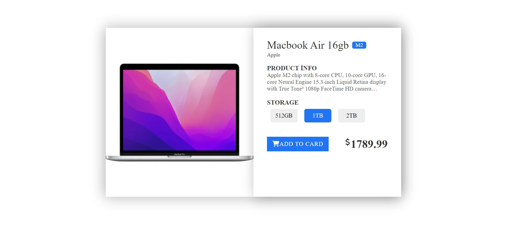

# Product Card

This is a simple product card showcasing a MacBook Air model with specifications and options for storage.

## Table of Contents

- [Description](#description)
- [Technologies Used](#technologies-used)
- [Preview](#preview)
- [How to Use](#how-to-use)
- [Contributing](#contributing)
- [License](#license)

## Description

The Product Card web page displays information about a MacBook Air model, including its specifications, storage options, and price.

## Technologies Used

- HTML5
- CSS3
- Font Awesome
- Google Fonts

## Preview

You can see a live demo of the project [here](https://media-quary3.vercel.app/).

## How to Use

1. Clone the repository.
2. Open the `index.html` file in your browser.

## Contributing

Contributions are welcome! Feel free to open a pull request or submit an issue.

## License

This project is licensed under the [MIT License](LICENSE).
